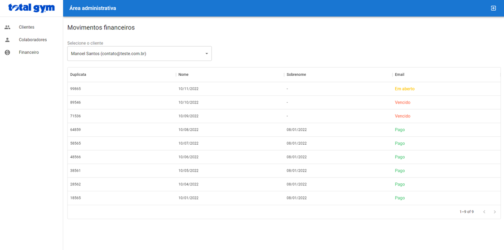

# projeto-plataforma-academia
</ >
Aplicação tem por objetivo final realizar gestão de academias voltada para a modalidade de Musculação. Realizando cadastros e operações administrativas, operacionais e gerenciais. Além da rotina de pagamentos!
</ >
 
# Tecnologias
</ >
**JAVA 11**
**SPRING BOOT**
**MAVEN**
**REACT**
**REACT ROUTER DOM**
**REACT TOASTIFY**
**MySql**
 
 
# Diretórios
</ >
*Aplicação contém Módulo único contendo os diretórios CONTROLLER, MODEL, REPOSITORY E SERVICE já implementados!* 
 
**utilizado neste projeto a dependência JpaRepository**
 
 
# API Rest [EndPoints Raiz]
</ >
**@RequestMapping("/api/aluno")**
**@RequestMapping("/api/exercicios")**
**@RequestMapping("/api/fichaavaliacao")**
**@RequestMapping("/api/fichatreino")**
**@RequestMapping("/api/gerarvencimentos")**
**@RequestMapping("/api/grupoexercicios")**
**@RequestMapping("/api/historicogeral")**
**@RequestMapping("/api/matricula")**
**@RequestMapping("/api/modalidade")**
**@RequestMapping("/api/modalidadehorario")**
**@RequestMapping("/api/pessoa")**
**@RequestMapping("/api/profissional")**
**@RequestMapping("/api/telefone")**
**@RequestMapping("/api/seriesercicios")**
**@RequestMapping("/api/endereco")**
 
 
 
# Observações
</ >
**Na pasta Documentação deixamos passos para instalação de algumas das tecnologias utilizadas neste projeto**
 
 
# Imagens de algumas das telas que o sistema possui
</ >
 

</ >
 

</ >
 

</ >